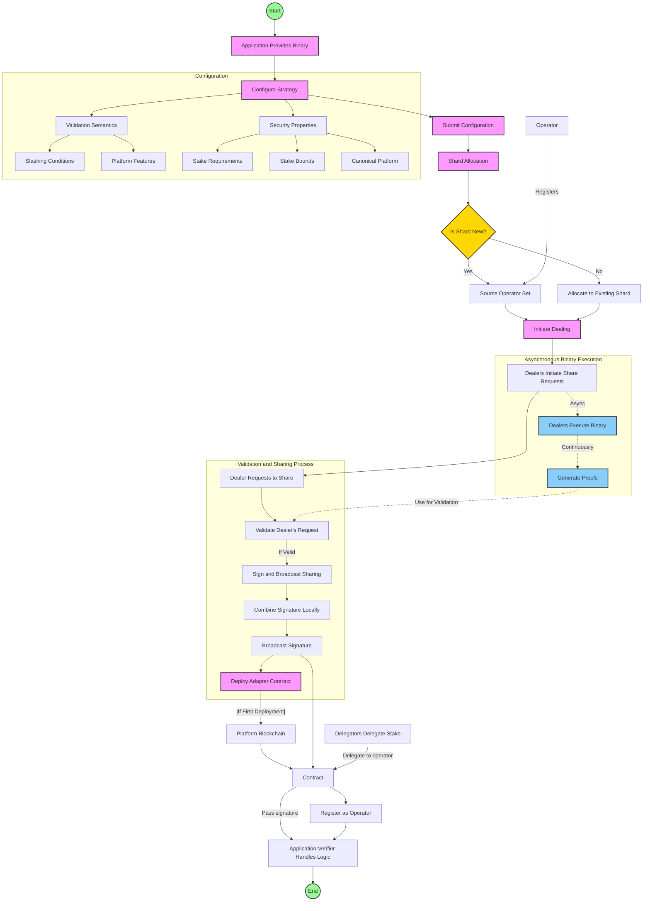

# Protocol Overview

Here we outline some details of the protocol.

## Threshold Signatures

The Nuff Protocol leverages the current state-of-the-art threshold signature protocol[^harts]. 

the following properties that enable the Nuff Protocol:
- Adaptable Signatures: Since the protocol outputs Schnorr signatures, these can be adapted and cheaply verified without the need for any specific precompiles in the underlying chain, this is an improved benefit over any pairing based signature.
- Adaptively secure: HARTS remains fully secure and operational up to `\(t_{c} < n/3\)` malicious parties. 
- Efficient: HARTS outputs a Schnorr signature of size $\lambda$ with a near-optimal amortized communication cost of $O\left(\lambda n^{2} \log n\right)$ bits and $O(1)$ rounds per signature. This means that dealing shares is amortized and that the signing round is constant. The arrangement of nonce shares happen offline once retrieved.
- Robustness: HARTS ensures guaranteed output delivery, even in asynchronous conditions.
- Internal agreement protocol: HARTS internally uses a VABA to agree on the dealers of the system. We can extend this VABA to agree on the message to be signed to protect the assets further.


> For the devnet, we have not yet decided on a curve for the signature, it would be useful to have a curve that is FFT-Friendly, although for now we are going to use `secp256k1` as we build out the protocol and decide on an FFT-Friendly curve when we introduce them. We can also explore EC-FFT.

> Furthermore, we are yet to decide on the following ideal parameters:
- `n`: number of parties 
- `\(t_{r}\)`: reconstruction threshold 

### Adapter 

The signing protocol outputs a schnorr signature, for this reason it is not compatible all underlying chains natively. 
Most chains use either secp256k1 or ed25519 for signing transactions.
To address this we introduce a ERC-4337[^4337] aware adaptor contract to the ethereum related chains. 

The Adaptor contract has the following responsibilities:
- Verify the Schnorr signature output by the TSS protocol.
- Pass a call on to the Restaking Platform to represent itself.

For adapting signatures on non-EVM chains, we will use something along the same approach with a generic WASM smart contract. 
This should cover the majority of use cases along NEAR, Cosmos, Arbitrum and Polkadot with minor adaptations for SDKs. 
Although challenges may arise since restaking platforms might be built on chains without smart-contract capabilities. For that we would likely adapt the scheme as needed.

It is not decided whether the Adaptor contract should have a many-to-one relationship with a shard or a one-to-one.
See the discussion around shards in the [sharding](sharding.md) section.

Platform assumptions for a restaking platform to be supported:
- Signature Verification:
    - native schnorr 
    - smart contract owned accounts

## Application Execution Flow 

For an application to register with the protocol, they must do the following:
- Provide a service binary, or location to get the binary. We omit standard operational requirements such as checksumming and versioning for brevity.
- Configure a strategy:
    - A configuration for the validation semantics. This is specific to the Application, but could involve slashing conditions, features of platforms and other mechanics.
    - The security properties of the application. Such as the stake required, bounds of stake, where from, the canonical platform. 


> TODO: flow chart

The properties of the application resolves them to a shard to either create an operator set or if the likeness properties allow, to append to an existing shard. This allows operators to support applications in a capital efficient but fair way, as well as allowing applications which have similar properties to share the stake adaptively.

> TODO: explain examples of likeness properties.

Now an application has been allocated a shard and operators have decided to support it: 
- If the shard is new: 
    - The protocol initiates a dealing 
    - Sources an operator set, or instructs guardians to support the application. Here we omit guardian details for later discussion.
    - Initiates a deployment of a contract (this might change if 1: or 1:1)
- If the shard is not new: 
    - The protocol allocates the application to the shard.
- Based on the allocated shard, the protocol signs a registers transaction and registers as an operator with the restaking platforms for the application.
- Delegators who wish to stake with the created shard delegate their stake to the operator. And notify Nuff Protocol of the delegation.
- The operators now execute the application blueprint, and the dealers of the protocol initiate share requests as per the application configurations. 
- Upon share requests, the participants agree on the validity of the message by applying the validation rules. If they agree they will sign and broadcast their sharing.
- If the sharing gets `\(t_{r} + 1\)` partial signatures, the protocol can combine the signature locally.
- Once a signature is combined, it can be broadcasted to the restaking platforms.
- The Application verifier can verify the signature and handle its logic as normal.

> TODO: flow chart

## Trust-minimised Slashing

For restaking platforms to account for an externalised asset, the canonical fork should be able to understand a representation of the asset on their native chain. 

A naive approach could be to use the wrapped asset that is socially agreed to be acceptable for that chain.
The problem with such an approach is that there are new trust assumptions on the custodian of the wrapped asset, and there is no real ownership of the underlying asset.

This is the benefit to the Nuff Protocol. It keeps the underlying asset in the custody of the native chain and introduces an important `right to slash` mechanism where the asset can only be unlocked under the following invariants:
- the user initiated a signal to withdraw and the withdrawal period has surpassed
- the canonical fork has signalled an event to slash the user and a proof has been provided to the platform

Now, since the native asset can be represented on the native chain, the projection can be any type of asset that is understandable by the platform, as long as there can be an agreed price oracle that the application is willing to accept. It could also apply weights based on the oracle selected.

> There is a further trust assumption in the light client protocol itself, where there is a great degree of variance in security. There are ways to improve the light client security past the base protocol, such as proof transactions[^solana light clients], extending the finality blocks past a period to increase social consensus[^stakesure] and slashable full nodes[^PoPoS/Fully insured light clients]. TODO: explore light client capabilities and put a table of trust assumptions.

> This approach to projected assets and right-to-slash is currently being researched. The main areas of research are Light Clients, Projecting, Prices and PoPoS[^insured light clients].

### Settlement Events

Settlement events are accounted for the shareholders in the shard by a public bulletin involved in the network and witnessable by the storage component. 
Participants involved in the attestation are therefore publically bound to any signature share they provided. 
Each event is natively settled on the restaking platform.

For rewards, the platform distributes based on the blockchain it chooses it's base, or in the greenfield nuff-aware systems, it can follow the dynamic fork-choice of the strategy while rewarding according to the semantics of the strategy.

There are variations of settlement based on:
- An application hard selects a canonical base: the canonical slashing event and rewards are passed down as a message to the follower restaking platform. The below example is EigenLayer being the canonical reward/slashing accounting restaking platform and Restaking B following the canonical decisions as a follower.
An important trustless component of this system is the Relayer. Any system observer who witnesses a slashing or reward event can provide an inclusion proof (or a zero-knowledge proof based on verification logic in the follower contract) of the event on the Ethereum network to the follower restaking platform.

### Right-to-slash

The right-to-slash mechanism is enforced by the Nuff Protocol. 
It is an escrow that is settled by the signalling to the escrow that an event has occurred on a restaking platform.
Once the event has happened, watchers of the system can sync with the underlying chain and provide the witness data and proof to the escrow for the locked asset.

```
slash := ( user, condition, witness, proof )
unlock := ( user, token, amount )
event := ( type: slash | unlock )
```

The watchers of the system can be facilitated by a binary or a light client wallet.
With a light client wallet, any user who is using the nuff protocol can also be watchers and look out for any events to relay. For capital efficiency, a relayer reward could be introduced, where the light clients for the users can be further utilised for innovating the protocol.

> Research into light client wallets for nuff protocol has not been started at this stage. We will assume a set of relayers would run the binary and fish for events to provide to the escrows.

> Rewarding relayers is another avenue for research.

### Prices

An application decides the prices and weights to the underlying assets. If an external native asset is introduces, the application must agree on an oracle to get the price for the asset, it might be acceptable in some use cases to accept the wrapped price for the purpose of security.

# Storage
The Nuff Protocol does not require an execution client, as it only needs to immutably and verifiably store configurations and retrieve them when necessary. The storage solution should be low-cost, high-performance, and resistant to corruption.
A distributed and decentralized storage system, such as IPFS or Arweave will be used for this purpose. 
Both systems offer immutability and credible commitments. 
Operators, delegators, and applications interacting with Nuff Protocol can directly engage with the storage solution. 
If they interact through downstream platforms, they must provide credible proofs (such as inclusion proofs or zero-knowledge proofs) for their actions (e.g., registering or delegating) to store their configurations in the storage solution.


Through the Nuff Protocol, operators of various restaking platforms who seek exposure to multiple platforms become shareholders in the protocol network based on the shard to which they choose to support. These operators run the application binaries and provide attestations by participating in the protocol. 
Depending on the results of on-chain verification, they either receive rewards or, if they are part of a slashed quorum, have their stake slashed. The operators benefit from having a VABA protocol internally to agree on a message and thus, have already partially reached an internal quorum of the state of the application.

# Security
Delegators and Operators maintain full custody of their assets and can directly initiate deposit, withdrawal, and strategy changes. 
The networks role is limited to providing signatures to the downstream restaking platform. 
In the event of collusion among the participants of the Nuff Protocol, the only possible action is the generation of an invalid signature, which would result in the slashing of the Nuff Protocol stake, including their own. 
From a game-theoretical perspective, rational participants have nothing to gain from such an attack.


