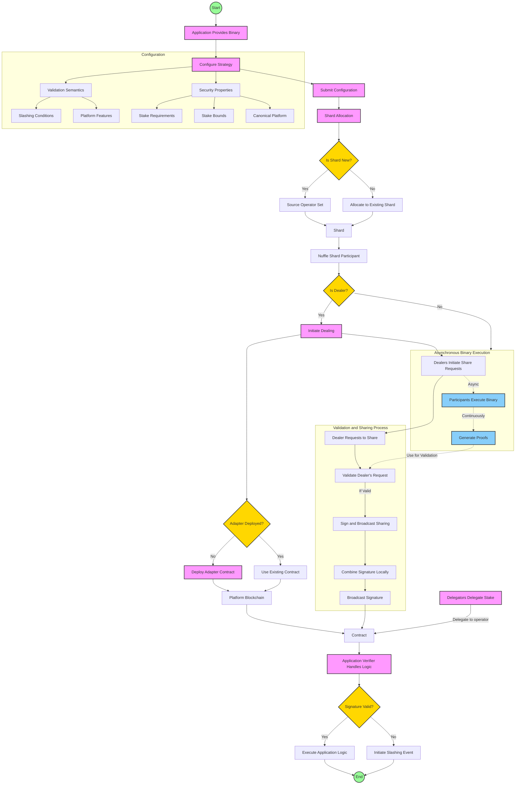

# Protocol Overview

Here we outline some details of the protocol.

## Threshold Signatures

The Nuff Protocol leverages the current state-of-the-art threshold signature protocol[^harts]. 

The following properties that enable the Nuff Protocol:
Adaptable Signatures: Since the protocol outputs Schnorr signatures, these can be adapted and cheaply verified without the need for any specific precompiles in the underlying chain. This is an improved benefit over any pairing-based signature.
- Adaptively secure: HARTS remains entirely safe and operational up to $t_{c} < n/3$ malicious parties. 
- Efficient: HARTS outputs a Schnorr signature of size $\lambda$ with a near-optimal amortized communication cost of $O\lambda n^{2} \log n$ bits and $O(1)$ rounds per signature. This means dealing shares is amortised, and the signing round is constant. The arrangement of nonce shares happens offline once retrieved.
- Robustness: HARTS ensures guaranteed output delivery, even in asynchronous conditions.
Internal agreement protocol: HARTS internally uses a VABA to agree on the system's dealers. We can extend this VABA to decide on the message to be signed to protect the assets further.


> For the devnet, we have not yet decided on a curve for the signature. It would be useful to have an FFT-friendly curve, although, for now, we are going to use `secp256k1` as we build out the protocol and decide on an FFT-friendly curve when we introduce them. We can also explore EC-FFT.

> Furthermore, we are yet to decide on the following ideal parameters:
- `n`: number of parties 
- `\(t_{r}\)`: reconstruction threshold 

### Adapter 

The signing protocol outputs a Schnorr signature, so it is not natively compatible with all underlying chains.
Most chains use either secp256k1 or ed25519 for signing transactions.
To address this, we introduce an ERC-4337[^4337] aware adaptor contract to the Ethereum-related chains. 

The Adaptor contract has the following responsibilities:
- Verify the Schnorr signature output using the TSS protocol.
- Pass a call on to the Restaking Platform to represent itself.

We will use the same approach with a generic WASM smart contract to adapt signatures on non-EVM chains. 
This should cover most use cases along NEAR, Cosmos, Arbitrum and Polkadot with minor adaptations for SDKs. 
However, challenges may arise since restaking platforms might be built on chains without smart-contract capabilities. For that, we would likely adapt the scheme as needed.

Whether the Adaptor contract should have a many-to-one relationship with a shard or a one-to-one is not decided.
See the discussion around shards in the [sharding](sharding.md) section.

Platform assumptions for a restaking platform to be supported:
- Signature Verification:
    - native schnorr 
    - smart contract-owned accounts

## Application Execution Flow 

For an application to register with the protocol, they must do the following:
- Provide a service binary or location to get the binary. For brevity, we omit standard operational requirements such as checksumming and versioning.
- Configure a strategy:
    - A configuration for the validation semantics. This is specific to the Application but could involve slashing conditions, platform features, and other mechanics.
    - The Application's security propApplicationh as the required stake, stake bounds, where from, and canonical platform. 


> TODO: flow chart

The applications resolved to a shard to create an operator set or append to an existing shard if the likeness properties allow it. This allocation allows operators to support applications in a capital-efficient but fair way and enables applications with similar properties to share the stake adaptively.

> TODO: explain examples of likeness properties.

Now, an application has been allocated a shard, and operators have decided to support it: 
- If the shard is new: 
    - The protocol initiates a dealing 
    - Sources an operator set or instructs guardians to support the Application. Guardian details are omitted here for later discussion.
    - Initiates a deployment of a contract (this might change if 1:- or 1:1)
- If the shard is not new: 
    - The protocol allocates the application Applications.
- Based on the allocated shard, the protocol signs a register transaction and registers as an operator with the restaking platforms for the Application. Applications that wish to stake with the created shard delegate their stake to the operator. And notify Nuff Protocol of the delegation.
The operators now execute the application blueprint, and the protocol dealers initiate share requests according to the application configurations. 
Upon sharing requests, the participants agree on the message's validity by applying the validation rules. If they agree, they will sign and broadcast their sharing.
- The protocol can combine the signature locally if the sharing gets $t_{r} + 1 partial signatures.
- Once a signature is combined, it can be broadcast to the restaking platforms.
- The application verifier can typically verify the signature and handle its logic.

> TODO: flow chart

## Trust-minimised Slashing

For restaking platforms to account for an externalised asset, the canonical fork should be able to understand a representation of the asset on their native chain. 

A naive approach could be to use the wrapped asset that is socially agreed to be acceptable for that chain.
The problem with such an approach is that there are new trust assumptions on the custodian of the wrapped asset, and there is no real ownership of the underlying asset.

This is the benefit of the Nuff Protocol. It keeps the underlying asset in the custody of the native chain. It introduces a critical `right to slash` mechanism where the asset can only be unlocked under the following invariants:
- the staker initiated a signal to withdraw, and the withdrawal period surpassed
- the canonical fork has signalled an event to slash the user, and proof has been provided to the platform

Now, since the native asset can be represented on the native chain, the projection can be any asset that the platform understands, as long as there is an agreed-upon price oracle that the Application accepts. It could also apply weights based on the oracle selected.

> There is a further trust assumption in the light client protocol itself, where there is a great degree of variance in security. There are ways to improve the light client security past the base protocol, such as proof transactions[^solana light clients], extending the finality blocks past a period to increase social consensus[^stakesure] and slashable full nodes[^PoPoS/Fully insured light clients]. TODO: explore light client capabilities and put a table of trust assumptions.

> This approach to projected assets and right-to-slash is currently being researched. The main research areas are Light Clients, Projecting, Prices and PoPoS[^insured light clients].

### Settlement Events

Settlement events are accounted for by the shareholders in the shard through a public bulletin involved in the network, which is witnessable by the storage component. 
Therefore, participants involved in the attestation are publicly bound to any signature share they provide.
Each event is natively settled on the restaking platform.

For rewards, the platform distributes based on the blockchain it chooses as its base. In greenfield nuff-aware systems, it can follow the strategy's dynamic fork choice while rewarding according to the strategy's semantics.

There are variations of settlement based on the following:
- An application hard selects a canonical base: the canonical slashing event and rewards are passed down as a message to the follower restaking platform. The example below is EigenLayer, the canonical reward/slashing accounting restaking platform, and Restaking B, which follows the canonical decisions as a follower.
An important trustless component of this system is the Relayer. Any system observer who witnesses a slashing or reward event can provide an inclusion proof (or a zero-knowledge proof based on verification logic in the follower contract) of the event on the Ethereum network to the follower restaking platform.

### Right-to-slash

The Nuff Protocol enforces the right-to-slash mechanism. 
An escrow is settled by signalling to the escrow that an event has occurred on a restaking platform.
Once the event has happened, the system's watchers can sync with the underlying chain and provide the witness data and proof to the escrow for the locked asset.

```
slash := ( user, condition, witness, proof )
unlock := ( user, token, amount )
event := ( type: slash | unlock )
```

A binary or a light client wallet can facilitate the system's watchers.
With a light client wallet, any user who is using the nuff protocol can also be a watcher and look out for any events to relay. For capital efficiency, a relayer reward could be introduced, where the light clients for the users can be further utilised to innovate the protocol.

> Research into light client wallets for nuff protocol has yet to be started. We will assume a set of relayers would run the binary and fish for events to provide to the escrows.

> Rewarding relayers is another avenue for research.

### Prices

An application decides the prices and weights for the underlying assets. If an external native asset is introduced, the Application on an oracle gets the price for the asset. In some use cases, it might be acceptable to accept the wrapped price for security purposes.

# Storage
The Nuff Protocol does not require an execution client; it only needs to immutably and verifiably store configurations and retrieve them when necessary. The storage solution should be low-cost, high-performance, and resistant to corruption.
A distributed and decentralised storage system, such as IPFS or Arweave, will be used. 
Both systems offer immutability and credible commitments. 
Operators, delegators, and applications interacting with Nuff Protocol can directly engage with the storage solution. 
If they interact through downstream platforms, they must provide credible proofs (inclusion proofs or zero-knowledge proofs) for their actions (e.g., registering or delegating) to store their configurations in the storage solution.


Through the Nuff Protocol, operators of various restaking platforms who seek exposure to multiple platforms become shareholders in the protocol network based on the shard to which they choose to support. These operators run the application binaries and provide attestations by participating in the protocol. 
Depending on the results of on-chain verification, they either receive rewards or, if they are part of a slashed quorum, have their stake slashed. The operators benefit from having a VABA protocol internally to agree on a message and thus have already partially reached an internal quorum.
Delegators and Operators maintain full custody of their assets and can directly initiate deposit, withdrawal, and strategy changes. 
The network's role is limited to providing signatures to the downstream restaking platform. 
In the event of collusion among the Nuff Protocol participants, the only possible action is the generation of an invalid signature, which would result in the slashing of the Nuff Protocol stake, including their own. 
From a game-theoretical perspective, rational participants have nothing to gain from such an attack.

